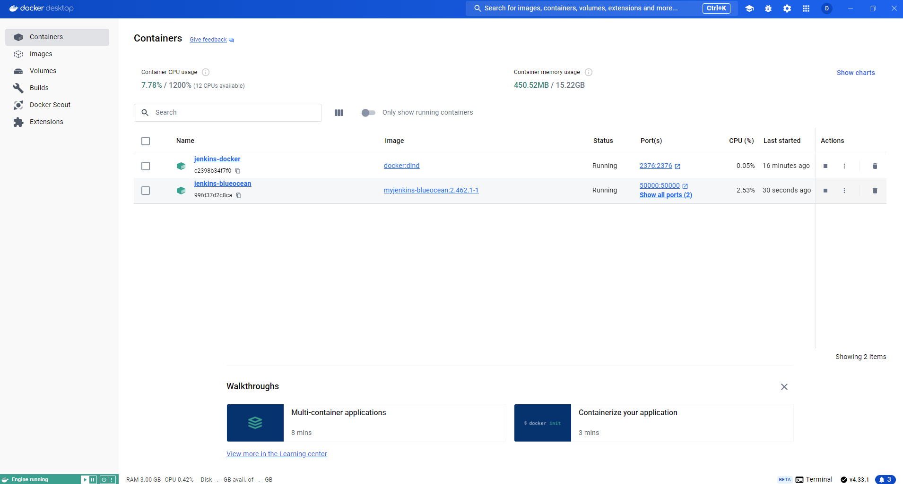
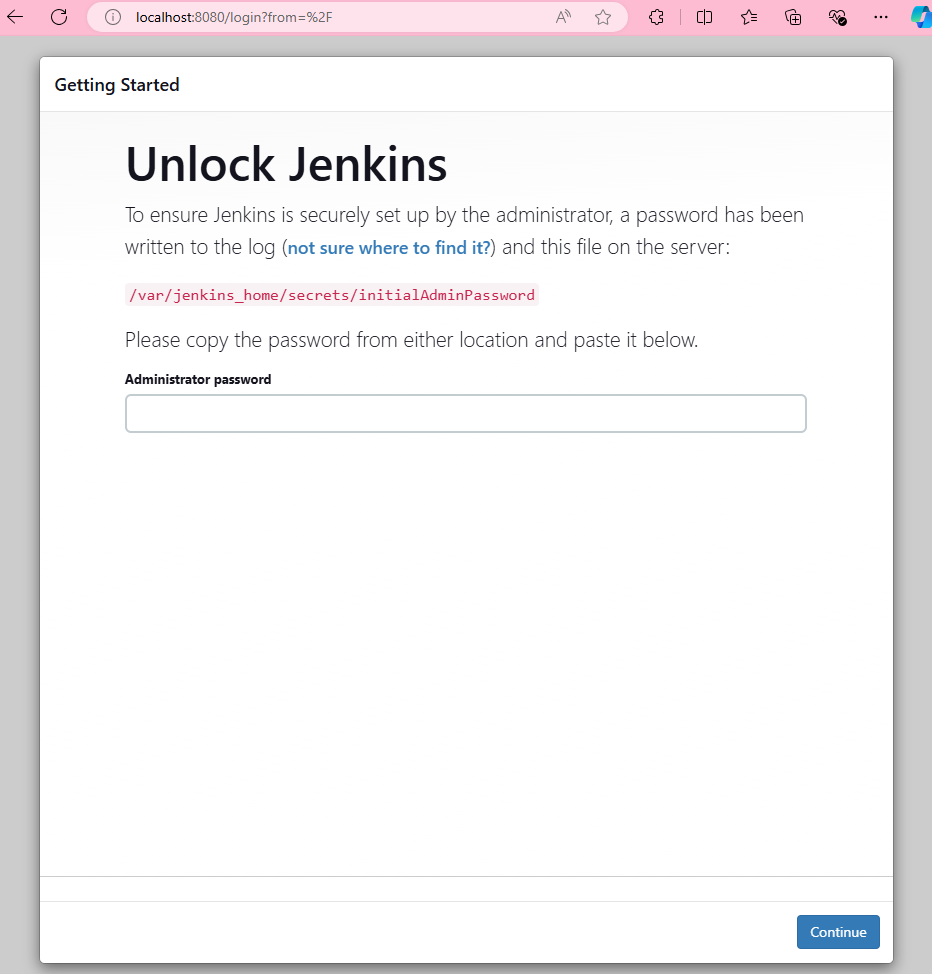
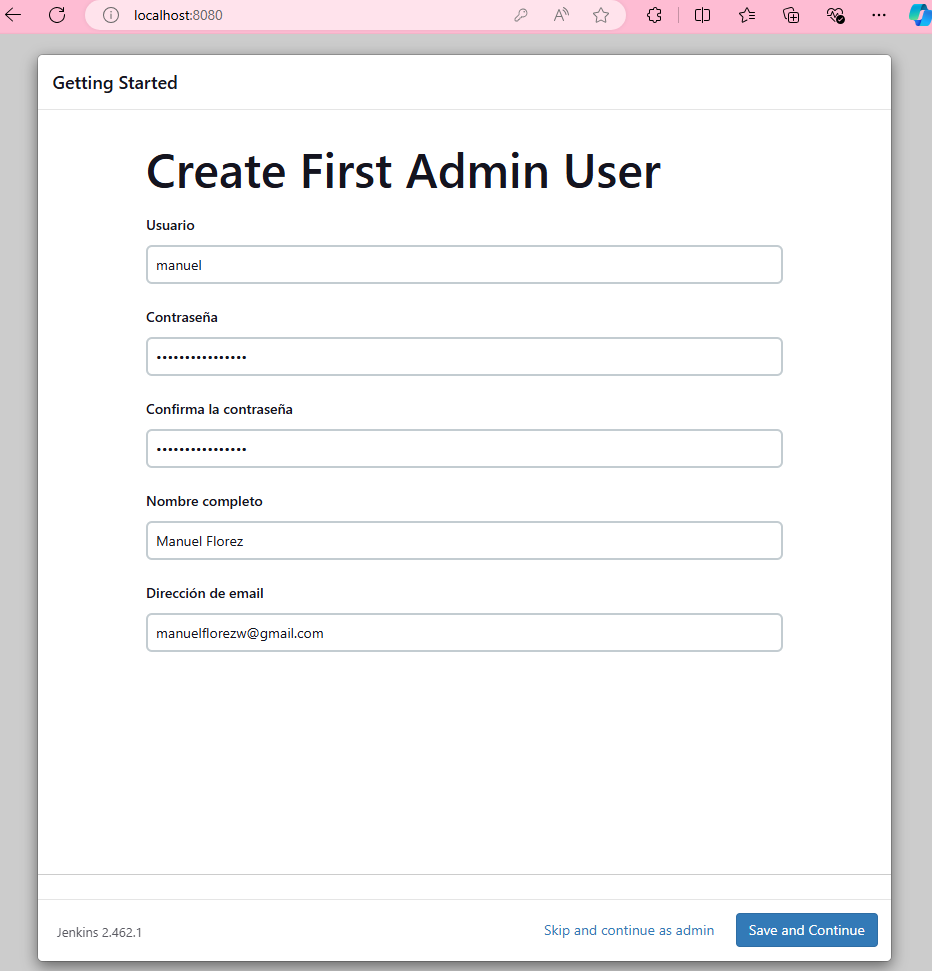
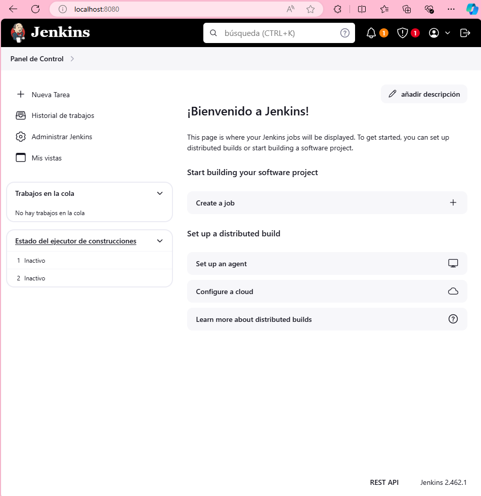

# Install Jenkins

## Create a bridge network in Docker using the following docker network create command

```bash
docker network create jenkins
```

## In order to execute Docker commands inside Jenkins nodes, download and run the docker:dind Docker image using the following docker run command

```bash
docker run --name jenkins-docker --rm --detach \
  --privileged --network jenkins --network-alias docker \
  --env DOCKER_TLS_CERTDIR=/certs \
  --volume jenkins-docker-certs:/certs/client \
  --volume jenkins-data:/var/jenkins_home \
  --publish 2376:2376 \
  docker:dind
```

## Build a new docker image from this Dockerfile, and assign the image a meaningful name, such as "myjenkins-blueocean:2.462.1-1"

```bash
docker build -t myjenkins-blueocean:2.462.1-1 .
```

## Run your own myjenkins-blueocean:2.462.1-1 image as a container in Docker using the following docker run command

```bash
docker run --name jenkins-blueocean --restart=on-failure --detach \
  --network jenkins --env DOCKER_HOST=tcp://docker:2376 \
  --env DOCKER_CERT_PATH=/certs/client --env DOCKER_TLS_VERIFY=1 \
  --volume jenkins-data:/var/jenkins_home \
  --volume jenkins-docker-certs:/certs/client:ro \
  --publish 8080:8080 --publish 50000:50000 myjenkins-blueocean:2.462.1-1
```

## (optional) PowerShell

```bash
bash init.sh
```

## Docker - Jenkins



## Start Jenkins



```bash
docker logs jenkins-blueocean
```

## Create First Admin User



## Dashboard



## Create image agent java21

```bash
docker build -t agent:java21 .
```
